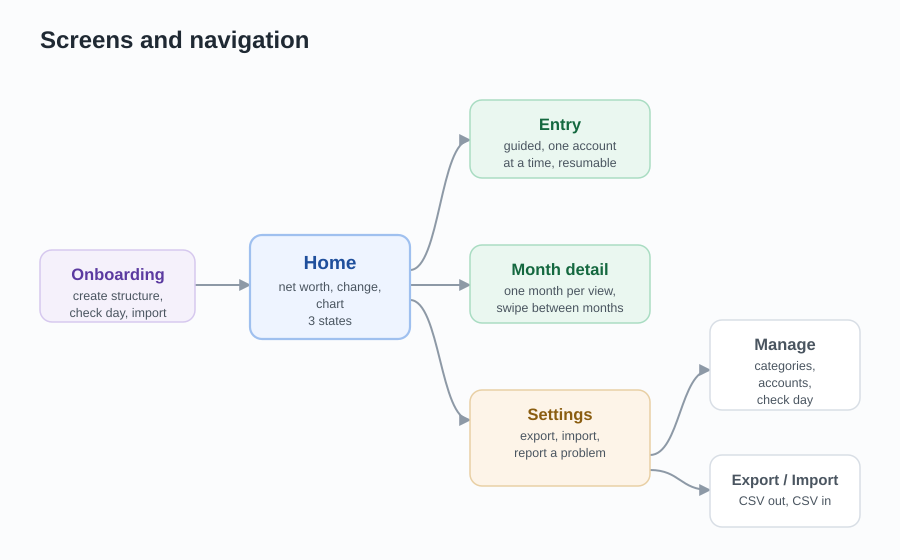
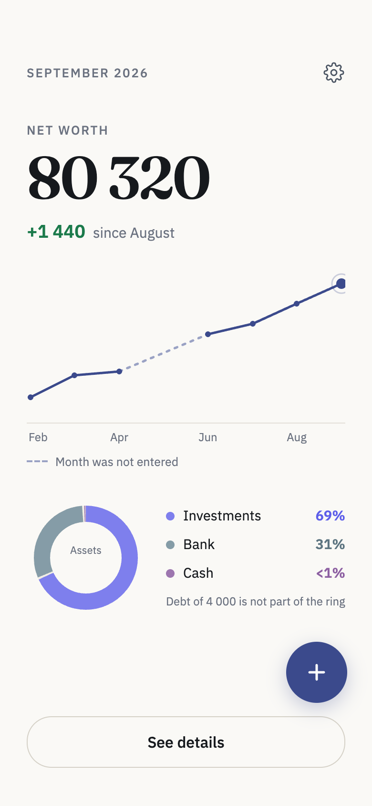
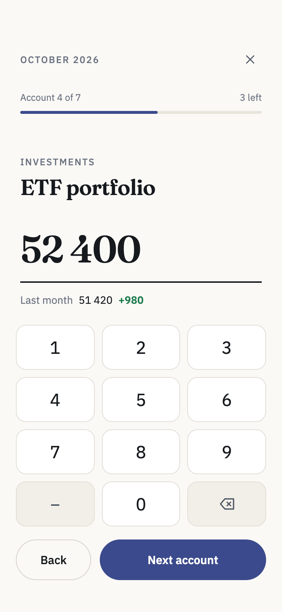
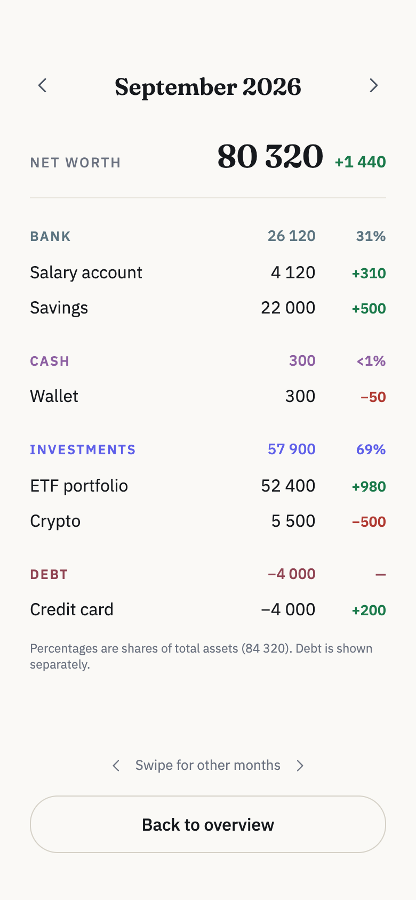

# 8. Screens and user flow

### Tasks

Before deciding on any screens, the tasks were collected: what a person actually does with this app. The screens were then derived from these tasks, not the other way around.

- Set up the app the first time: create categories and accounts, choose the check day
- Bring in past months at the start, by entering them or importing a CSV file
- Enter this month's numbers
- Continue an entry that was interrupted
- See how I am doing: current total, change since last month, the trend over time
- Look at one specific month in detail
- Correct a number that was entered wrong
- Add, rename or deactivate an account later on
- Get my data out as a CSV file
- Bring data in from a CSV file
- Change the check day
- Report a problem or ask for a feature

### Tasks mapped to screens

| Task | Screen |
| ---- | ------ |
| Set up the app the first time | Onboarding |
| Bring in past months at the start | Onboarding (entering or importing) |
| Enter this month's numbers | Entry |
| Continue an interrupted entry | Home (button) → Entry |
| See how I am doing | Home |
| Look at one month in detail | Month detail |
| Correct a wrong number | Month detail |
| Add, rename or deactivate an account | Manage |
| Export a CSV file | Settings |
| Import a CSV file | Settings (and Onboarding) |
| Change the check day | Manage (and Onboarding) |
| Report a problem | Settings |

Two things stand out from this mapping. The tasks the user performs regularly — seeing the state and entering a month — are covered by two screens, while everything else happens rarely and sits behind the settings. And two functions appear twice, import and the check day, because they are needed both during the first setup and later on. They are therefore built once in the data layer and used by two screens.

### The screens

| Screen | Purpose |
| ------ | ------- |
| Home | The only screen the user sees most of the time: current net worth, change since last month, chart, entry button, settings. |
| Entry | Guided entry of one month, one account at a time, resumable. |
| Month detail | Viewing a single month per category, swiping between months, correcting values. |
| Settings | Export, import, report a problem, and the way into Manage. |
| Manage | Everything the user sets up: categories, accounts and the check day. |
| Onboarding | First start: create the structure, choose the check day, optionally import or enter past months. |

### Navigation

### Home

Home carries three states, because what is useful depends on how much data exists.

**No entries yet.** No chart and no invented data. Instead a countdown to the next check day, so the user knows when something will happen.

**Data exists.** The net worth as one large number, the change since the previous month below it, and the chart over time. A button leads to the month detail, a floating button starts a new entry, and the settings wheel sits in the top right corner.

**An entry was interrupted.** The entry button continues the unfinished month instead of starting a new one. This is where V1-5 becomes visible to the user.

### Entry

The user is walked through the active accounts one by one. Only active accounts are asked for. The flow can be interrupted at any point — the user will switch to a banking app between almost every number — and continues at the same account with the values already entered.

### Month detail

One month fills the screen, grouped by category. Swiping left and right moves between months.

Next to each account stands a small secondary number: the change compared to the previous month. It is green when the value grew and red when it fell, and it always carries a sign (+240, −85). The colour makes the direction quick to spot, and the sign keeps it readable for colour-blind users and in bright sunlight, where colour alone would not be enough.

Values can be corrected here. Nothing else is changed here.

### Why viewing and managing are separated

Looking at history and changing the structure are different tasks with very different frequencies. History is looked at often, accounts are touched a few times a year. Mixing them would make the most-used screen busier and would place "deactivate account" one wrong tap away from normal browsing. The month detail therefore only views and corrects numbers, while categories, accounts and the check day are managed on their own screen behind the settings. The split is along that line: Settings holds things the user does with the app — export, import, report a problem — while Manage holds everything the user sets up.

### Why onboarding is its own screen

Onboarding and entry feel similar, but they do opposite things: onboarding creates the structure, entry fills in values. They share the step-by-step pattern, not the screen. When onboarding is finished, it leads directly into the first entry.

### Mockups

The mockups were made with Claude Design. The text of this chapter served as the brief — the screens, their states and what belongs on each were already written down, so the tool only had to turn a description into a layout. Afterwards the screens were adjusted directly in the editor until they felt right.

Only Home, Entry and Month detail were designed. Settings, Manage and Onboarding deliberately were not: they are plain lists and should look like the standard screens of the operating system. Designing them individually would cost time and would make them worse, because users expect a settings screen to look like a settings screen.

A few decisions that the pictures show but do not explain:

- The numbers are consistent across all three screens. The accounts in the detail view add up to the total on the home screen, and the changes add up to the change shown there. Mockups with random numbers hide layout problems that only appear with real data.
- The entry screen shows the value of the previous month under the input field. It is the cheapest possible check against a typing mistake: entering 5 240 instead of 52 400 is immediately visible.
- The keypad sits in the lower third of the screen so it stays reachable with the thumb, and it has a minus key for credit cards and loans.
- The percentages in the ring are shares of the assets, not of the net worth. A ring shows parts of a whole and cannot display a negative share, so debt is listed next to it instead.

The mockups show how the app should look, not how it will be built. Colours in particular are provisional and will probably change once the app has a name.

---

[← Architecture and data model](07-architecture.md)  ·  [Implementation notes →](09-implementation-notes.md)  ·  [Overview](../README.md)
