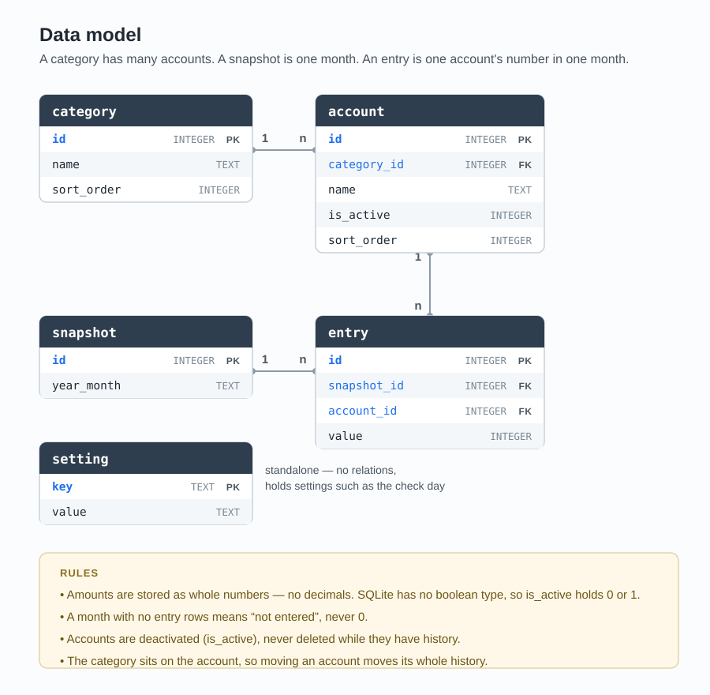
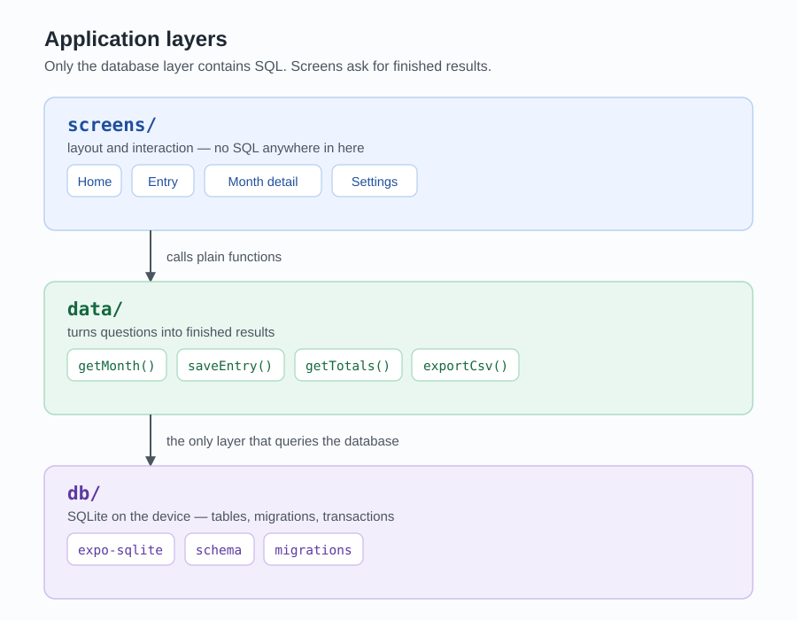

# 7. Architecture and data model

### Data model

| Table | Columns | Meaning |
| ----- | ------- | ------- |
| category | id, name, sort_order | A group chosen by the user, for example "Bank", "Cash", "Investments". |
| account | id, category_id, name, is_active, sort_order | One account inside a category, freely named by the user. |
| snapshot | id, year_month | One month, for example "2026-09". Unique — a month exists only once. |
| entry | id, snapshot_id, account_id, value | The number of one account in one month. |
| setting | key, value | Settings such as the chosen check day. |

Read as a sentence: a category has many accounts, a snapshot is one month, and an entry is one account's number in one month.

### The setting table

The other tables hold rows of similar things — many categories, many accounts. The setting table is different: it holds name and value pairs, one row per setting.

| key | value |
| --- | ----- |
| check_day | 15 |
| onboarding_done | 1 |
| last_export | 2026-11-01 |

This is why `key` is TEXT and is itself the primary key: the name of the setting already identifies the row, so no separate id is needed. `value` is TEXT because the values are of different kinds — a day number, a yes/no, a date — and a single column can only have one type.

The alternative would be a table with one column per setting and exactly one row in it. That would be properly typed and checked by the database, but every new setting would need a database migration.

**Decision:** the key and value version is used. Adding a setting stays a one-line change. To keep the type safety that TypeScript was chosen for, each setting gets its own small function in the data layer that converts and checks the value, so the conversion happens in exactly one place and the screens receive proper types.

### Decision 3: Numbers are stored without decimals

Amounts are stored as whole numbers. The user cannot enter decimals at all — the app rounds to the nearest whole number.

The usual argument against rounding is that the errors add up. In this app they cannot. Every month is entered fresh from the bank and is never calculated from the previous month, so the error is at most half a unit per account per month and resets with the next entry. With five accounts the worst case is around 2.50 on a number in the thousands, and roundings in opposite directions partly cancel each other out. For a tool that shows a trend, this is far below the level that matters.

What is gained: cleaner and shorter numbers on screen, and no conversion between stored and displayed values in the code.

Consequence: if a CSV file is imported with decimal values, the app rounds them instead of rejecting the file.

### Decision 4: A missing month has no entries at all

If a month was not entered, no entry rows exist for it. A missing entry is never stored as the number 0.

"I did not enter anything in October" and "this account was empty in October" are two different facts and must never be mixed up. The dotted line in V2-6 depends on telling them apart, and a total that treated missing entries as zero would show a drop in net worth that never happened.

### Decision 5: Accounts are deactivated, not deleted

An account has an `is_active` flag. Deactivated accounts disappear from the entry flow and from the current view, but they appear automatically again when the user looks at a period in which that account had numbers.

Real deletion exists, but behaves differently depending on the situation:

- An account without any entries is deleted directly. It was created by mistake and there is nothing to lose.
- An account with history can only be deleted after a clear warning that all of its numbers are permanently gone and that past totals will change because of it.

### Decision 6: The category belongs to the account, not to the entry

If an account is moved to another category, its whole history moves with it. Past views are therefore reorganised as well.

The alternative would be to store the category with every single entry. That would keep history literally accurate, but it would roughly double the complexity of the model and make every query harder. For an app of this size the simple version is the better trade.

The effect is limited and intended: the overall total of a past month never changes, only the distribution across categories.

### Decision 7: A month is its own table

The entries could also carry the month directly — `entry(year_month, account_id, value)` — and the snapshot table could be dropped. That would be one table and one join less. The question behind it is whether a month is a thing of its own in this app, or only a label on an entry. Three reasons say it is a thing of its own.

**A month can have its own data.** When it was entered is a fact about the month, not about a single account. October's numbers entered on the 3rd of November belong to the month. A later version could also allow a note per month — "bonus paid", "car sold" — which explains a jump in the chart. Without a snapshot table there is no place for any of this except repeated on every entry row.

**The unfinished entry needs a place to live.** V1-5 requires that an interrupted entry can be resumed. If that progress only exists in memory, it is lost as soon as the operating system closes the app in the background, which is exactly the situation V1-5 is about. A snapshot row with a status such as "in progress" survives that.

**The month exists exactly once.** If the month is written on every entry row, the same month is stored again and again, and nothing prevents "2026-9" and "2026-09" from both appearing after a CSV import. That would silently split one month into two in the chart. With its own table and a unique constraint, the month is written once and everything else points to it.

The cost is one join and one additional table, which is irrelevant at this data volume.

**Decision:** the snapshot table stays.

### Layers

The rule: only the data layer talks to the database. Screens never contain SQL, they call functions and receive finished results.

Without this rule, SQL ends up spread over every screen. A later change — renaming a column, or adding the condition that only active accounts are counted — would have to be found and repeated in every one of those places, and the one place that is forgotten becomes a bug that shows wrong numbers. That is exactly the kind of bug this app cannot afford.

With the rule, such a change happens in one file. Screens stay readable because they are about layout and interaction, and the data functions can be tested on their own without opening the app.

The cost is one extra step: a new number on screen needs a function in the data layer first. This is slower on the first day and easier from the third week on. This is also what R9 means in practice.

---

[← Options and decisions](06-decisions.md)  ·  [Screens and user flow →](08-screens.md)  ·  [Overview](../../README.md)
